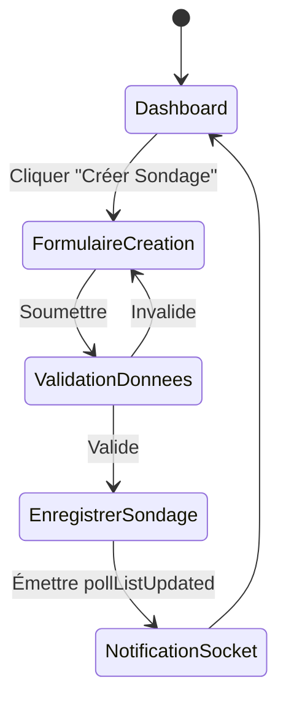
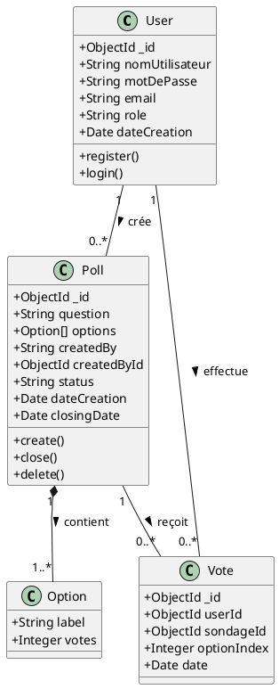
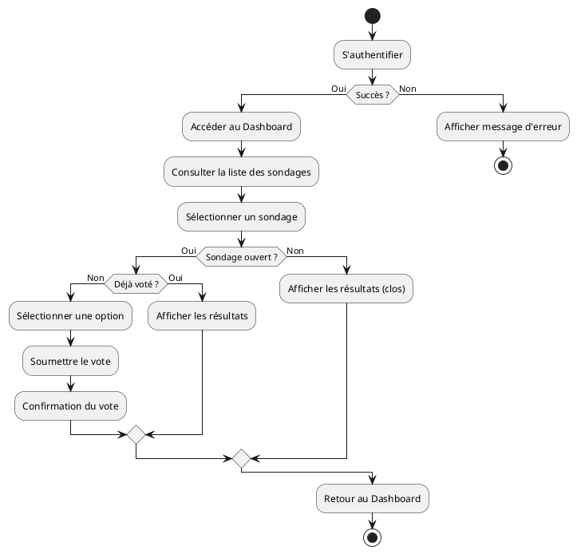

# Diagrammes du Projet PollVision

Ce document contient les diagrammes de classe et d'activité pour le rapport de projet.

## 1. Diagramme de Classe

Le diagramme de classe suivant modélise les entités principales de l'application et leurs relations, basé sur l'implémentation MongoDB et Node.js.

```mermaid

```

---

## 2. Diagramme d'Activité

Le diagramme d'activité suivant illustre le flux principal d'un utilisateur, de l'authentification au vote ou à la création de sondage.

### Flux Utilisateur (Vote)

```mermaid
stateDiagram-v2
    [*] --> Connexion
    Connexion --> Authentification
    Authentification --> Dashboard : Succès
    Authentification --> Connexion : Échec

    Dashboard --> ListeSondages : Consulter
    ListeSondages --> VerifierVote : Sélectionner Sondage
    
    state VerifierVote <<choice>>
    VerifierVote --> VoirResultats : Déjà voté / Fermé
    VerifierVote --> Voter : Pas encore voté & Ouvert

    Voter --> EnregistrerVote
    EnregistrerVote --> Dashboard
    VoirResultats --> Dashboard
```

### Flux Création de Sondage (Admin/Propriétaire)



---

## 3. Diagramme de Cas d'Utilisation (Bonus)

```mermaid
graph TD
    User((Utilisateur))
    Admin((Administrateur))

    User --> Login[S'authentifier]
    User --> Browse[Consulter les sondages]
    User --> Vote[Voter]
    User --> History[Consulter son historique]
    User --> Create[Créer un sondage]

    Admin --> Manage[Gérer tous les sondages]
    Admin --> Close[Fermer un sondage]
    Admin --> Delete[Supprimer un sondage]
    Admin --> ViewStats[Voir les détails des votes]

    Manage --- Admin
    Admin --|> User
```

---

## 4. Diagramme de Classe (PlantUML)

Copiez ce code dans [PlantText](https://www.planttext.com/) ou un éditeur PlantUML.



---

## 5. Diagramme d'Activité (PlantUML)


