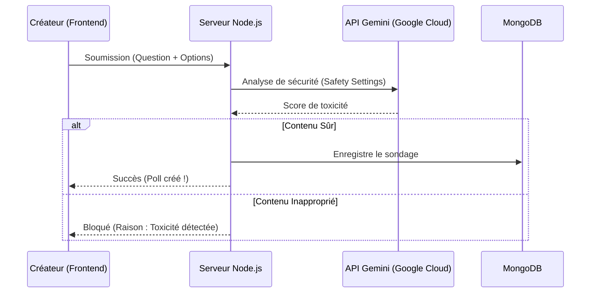

# Visualisation des Fonctionnalités Innovantes : PollVision

Voici la version raffinée de vos idées pour rendre l'interface de **PollVision** dynamique et réactive.

---

## 1. Feature : "Dynamic Glows" (Interactions Lumineuses)

Nous divisons cette fonctionnalité en deux événements distincts pour une clarté maximale.

### ⚡ A. Vote Glow (Réaction Instantanée)
**Le Concept :** Dès qu'un utilisateur vote, le sondage correspondant émet un flash lumineux pour signaler l'activité aux autres personnes connectées au Dashboard.

*   **Déclencheur** : Réception de l'événement `pollUpdated` via Socket.io.
*   **Visuel** : Une bordure **Émeraude** (Vert vif) qui s'illumine pendant 2 secondes puis s'estompe.
*   **Impact** : "Preuve sociale" immédiate — l'utilisateur sent que l'application est vivante.

### 🕒 B. Time Pressure Glow (Urgence Finale)
**Le Concept :** Le sondage commence à attirer l'attention visuellement lorsqu'il est sur le point d'expirer.

*   **Déclencheur** : Temps restant `< 10 minutes`.
*   **Visuel** : Une pulsation lente **Ambre/Rouge** qui s'accélère à mesure que le temps s'écoule.
*   **Niveaux d'intensité** :
    *   `10 min` : Pulsation douce (toutes les 3s).
    *   `2 min` : Pulsation rapide (toutes les 1s).
    *   `< 30s` : Clignotement d'alerte.

---

## 2. Pistes d'Améliorations Créatives (Bonus)

Pour rendre ces deux fonctionnalités encore plus impressionnantes, voici quelques idées :

1.  **Code Couleur Sémantique** :
    *   **Vert** : Nouveau Vote.
    *   **Orange** : Moins de 10 min.
    *   **Violet** : Sondage créé par un ami ou une personne suivie (si social).

2.  **Effets de Particules (Confettis de Vote)** :
    *   Lorsqu'un vote est reçu, de petites particules discrètes jaillissent du bouton de vote ou du compteur pour célébrer l'interaction.

3.  **Indicateur de "Vitesse" (Hotness)** :
    *   Si un sondage reçoit plus de 5 votes en une minute, il gagne une icône de "flamme" 🔥 et un léger halo de chaleur permanent.

4.  **Micro-Interactions Sonores** :
    *   Un son très subtil (un "pop" ou un "ping" cristallin) lors d'un vote reçu en direct, désactivable dans les paramètres de profil.

---

## 3. Feature : Modération par IA (Gemini)

**Le Concept :** Utiliser l'API Gemini pour analyser le texte d'un sondage (Question + Options) au moment de sa création.

